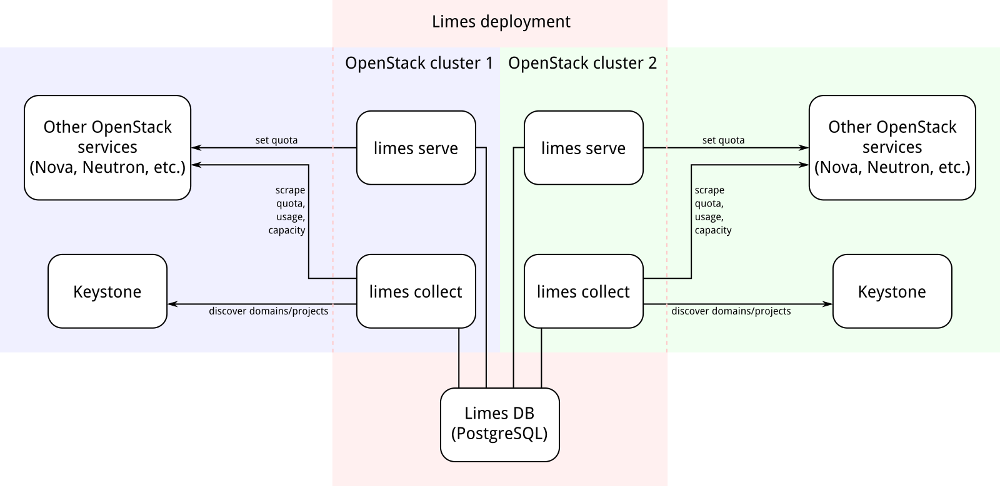

# Overview



Limes consists of two basic services:

- The **API service** `limes serve` exposes an OpenStack-style REST API that shall be exposed to users. It talks to
  - Keystone for authorization of users and to fulfil project/domain discovery requests synchronously, and to
  - all other supported OpenStack services to set quotas.
- The **collector service** `limes collect` performs various regular upkeep jobs. It talks to
  - Keystone to discover new domains/projects or updates to existing ones, and to
  - all other supported OpenStack services to gather quota/usage/capacity data.
- Both services emit Prometheus metrics. See [List of metrics](./metrics.md) for details.
- Persistence is provided by a PostgreSQL database which is accessible to both services.

## Support for shared services

Limes includes support for services that are shared across *OpenStack clusters* (i.e. separate OpenStack installations
with separate service catalogs). In this case, multiple instances of the API service and the collector service (one each
per cluster) will share the same Postgres database, but use different *cluster IDs* to identify their cluster's data
within the database.

A *shared service* is a backend service which is available in multiple clusters. For example, a Swift object storage
setup can have multiple proxy deployments which each authenticate against a different cluster's Keystone. In this case,
the total capacity which is reported by the shared service needs to be distributed among all clusters using the shared
service.

When one of the clusters uses Limes only for the shared service, not for its local resources, Limes can be configured to
only collect and manage the resources provided by shared services. Please refer to the [configuration
guide](./config.md) for details.

# Building

This repository contains a `Makefile` with an `install` target that understands the conventional `DESTDIR` and `PREFIX`
variables, so it should be fairly easy to build a RPM/Debian/whatever package by following the standard procedures.

```bash
$ cd limes
$ make install DESTDIR=/tmp/install
GOPATH=/x/src/github.com/sapcc/limes/.gopath GOBIN=/x/src/github.com/sapcc/limes/build go install  -ldflags '-s -w' 'github.com/sapcc/limes'
install -D -m 0755 build/limes "/tmp/install/usr/bin/limes"
```

The only required build dependency is [Go][go]. Version 1.9 or higher is required. Go is only a build dependency, not a
runtime dependency, so this should not be a dealbreaker if you plan to use Limes on a distribution whose repos carry an
older Go. The only runtime dependency is a libc.

If you're doing stuff with Docker, you can use the `Dockerfile` in this repo. Just invoke `docker build` in the usual manner.

# Installation

If you're using Kubernetes, you can use our team's [Helm chart for Limes][chart] which automates a lot of this process.

1. Setup a PostgreSQL instance. (Refer to the PostgreSQL manual or your distribution's documentation for details.)

2. Create a service account in every OpenStack cluster that Limes is going to connect to. The service user must have
   enough permissions to list all domains and all projects in Keystone, and to read and write quotas and usage data in
   all relevant backend services.

3. Write a configuration file for Limes, by following the [configuration guide](./config.md).

4. Configure [quota seeds](./seeding.md) if desired.

5. Prepare the database schema for Limes by running `limes migrate /path/to/config.yaml`.

6. Start both the API service and the container service once for each cluster.

   ```bash
   $ limes serve /path/to/config.yaml $cluster_id
   $ limes collect /path/to/config.yaml $cluster_id
   ```

   There should be only one instance of the collector service. The API service can be scaled out by simply starting
   additional instances with the same configuration and cluster ID.

7. For each cluster, register the public URL of the API service in the Keystone service catalog with service
   type `resources`. Note that the API service only exposes HTTP, so you probably want to have some sort of reverse
   proxy in front for load balancing and TLS termination.

## Logging

Both components present log messages on standard error, but they are usually very quiet. You should at least see
something like `listening on :8080` for both services since they both expose HTTP. (In the collector service, this is
only used for Prometheus metrics.)

### API service

The API service will log requests in the "combined" log format as used by nginx, except that the timestamp is shown at
the front to be consistent with the rest of the log. The reported log level is "REQUEST".

```
2017/02/02 11:49:49 REQUEST: 127.0.0.1 - - "GET /v1/domains HTTP/1.1" 200 987 "-" "curl/7.58.0"
```

When a 5xx response is generated, the API service will additionally log the response body with log level "ERROR".

```
2018/02/02 12:32:59 REQUEST: 127.0.0.1 - - "GET /v1/domains HTTP/1.1" 500 52 "-" "curl/7.58.0"
2018/02/02 12:32:59 ERROR: during "GET /v1/domains": dial tcp [::1]:5432: getsockopt: connection refused
```

### Collector service

When the collector service is started for the first time, you should immediately see a bunch of log messages indicating
the discovery of the existing Keystone domains and projects. Quota/usage scraping will start a few seconds after that.
Scraping is usually pretty silent, but errors will always be logged (the most common error source being the temporary
unavailability of a backend service). So if no errors occur in the first few minutes, everything is working fine.

[go]:       https://golang.org
[chart]:    https://github.com/sapcc/helm-charts/tree/master/openstack/limes
